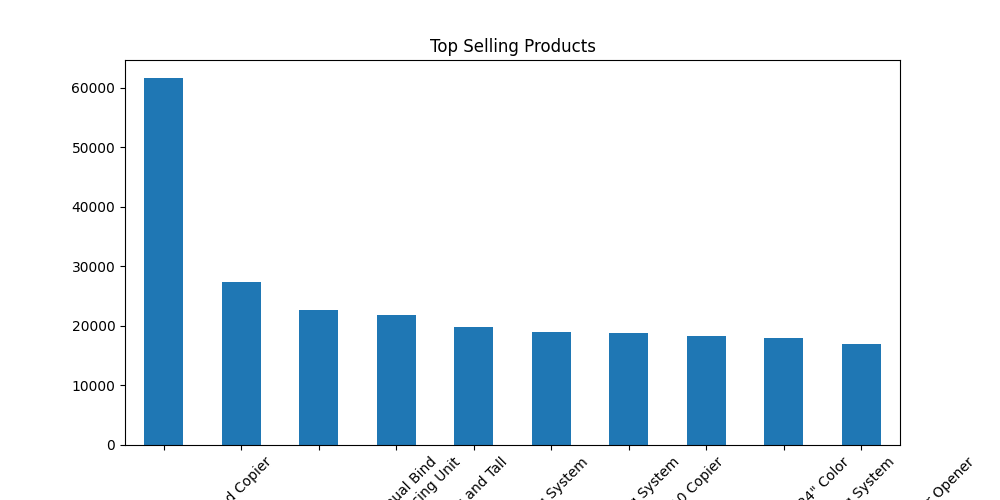
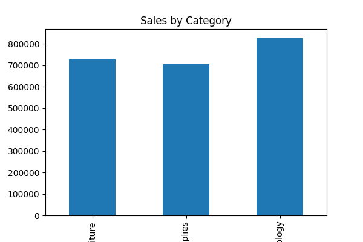
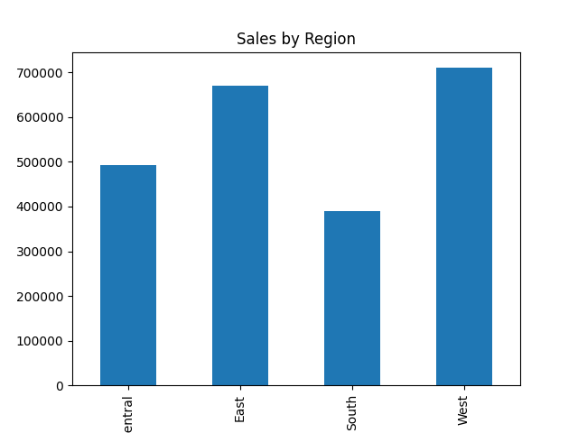

# Superstore Sales Analysis 📊

## 📌 Project Overview
This project analyzes a Superstore dataset to understand sales trends, product performance, and regional distribution.

---

## 🛠 Tools Used
- Python
- Pandas
- Matplotlib

---

## 📊 Analysis Performed
- Monthly Sales Trend
- Top Selling Products
- Sales by Category
- Sales by Region

---

## 🔍 Key Insights
- Sales show an overall increasing trend from 2015 to 2018, indicating business growth.
- Significant spikes in sales are observed during certain months, suggesting seasonal demand.
- A few top products contribute a large portion of total revenue.
- Technology category generates the highest sales among all categories.
- The West region contributes the most to overall sales.
- Sales distribution varies significantly across categories and regions.

---

## 📈 Visualizations

### Monthly Sales Trend

### Top Selling Products

### Sales by Category

### Sales by Region

